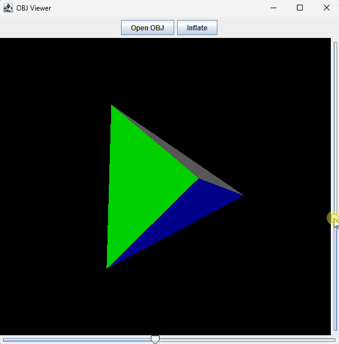

# Java Software 3D Renderer

Built as a small experiment to understand how 3D rendering works without relying on OpenGL.

A simple 3D software renderer written in Java using Swing.

This project renders `.obj` models without OpenGL or external graphics libraries. Everything is implemented manually: transformations, triangle rasterization, z-buffering, and basic shading.

## Features

- OBJ file loading
- Triangle rasterization
- Z-buffer (depth buffer)
- Per-face lighting (based on surface normal)
- Interactive rotation (mouse sliders)
- Load custom models at runtime
- Mesh subdivision ("inflate")

## Demo



## How it works

The renderer follows a basic 3D pipeline:

1. Load vertices and faces from an OBJ file
2. Apply rotation using 3x3 matrices
3. Project 3D coordinates to screen space (orthographic)
4. Rasterize triangles using barycentric coordinates
5. Use a z-buffer to handle depth
6. Compute simple shading using triangle normals

No GPU acceleration is used. All rendering is done on the CPU.

## Controls

- Horizontal slider → rotate around Y axis
- Vertical slider → rotate around X axis
- "Open OBJ" → load a model from disk
- "Inflate" → subdivide the mesh

## Running

Open the project in IntelliJ IDEA and run:

```text
DemoViewer.java
```

Requires Java 8 or newer.

## Project structure

```
src/
  DemoViewer.java     // UI + application setup
  RenderPanel.java    // rendering logic
  ObjLoader.java      // OBJ parsing
  Matrix3.java        // matrix math
  Vertex.java         // 3D point
  Triangle.java       // triangle data
models/
  *.obj               // example models
```

## Notes

- Rendering is orthographic (no perspective projection)
- Large meshes may reduce performance (CPU rasterizer)
- OBJ support is minimal (only vertices and faces)

## Future improvements

- Perspective projection
- Backface culling
- Wireframe mode
- Texture mapping

## License

MIT